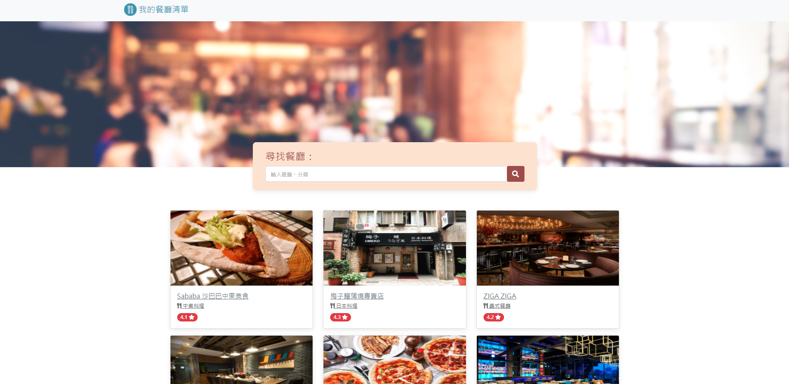

# 我的餐廳清單



# 產品功能

- 瀏覽所有餐廳和基本資訊
- 透過搜尋關鍵字，找到對應餐廳
- 點擊餐廳可查看餐廳詳細資訊
- 餐廳地址可連接到google map

# 專案安裝流程

1.請先確認有安裝 node.js 和 npm

2.將專案clone到本地

3.在本地開啟之後，透過終端機進入資料夾，輸入：
  ```
  npm install
  ```
4.安裝完畢後，繼續輸入：
  ```
  npm run dev
  ```
5.若看見此行訊息則代表順利運行，打開瀏覽器進入到以下網址
  ```
  Listening on http://localhost:3000
  ```
6.若欲暫停使用
  ```
  ctrl + c
  ```
# 開發工具

- Node.js 18.13.0
- Express 4.16.4
- Express-handlebars 3.0.0
- Bootstrap 5.1.3
- Font-awesome 5.8.1